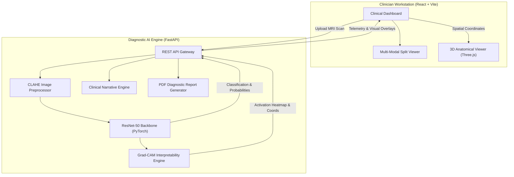

# NeuroScan: Deep Learning Brain Tumor Detection & Diagnostic Assistant

[](https://www.python.org/)
[](https://pytorch.org/)
[](https://fastapi.tiangolo.com/)
[](https://reactjs.org/)
[](https://vitejs.dev/)
[](https://threejs.org/)
[](LICENSE)
[](#model-evaluation--performance)

> **An End-to-End Medical Imaging Diagnostic Platform** combining Deep Residual Learning (ResNet-50), Explainable AI (Grad-CAM), 3D Anatomical Coordinate Localization, and Automated Medical Reporting.

---

## Executive Summary

Brain tumor segmentation and classification from magnetic resonance imaging (MRI) is vital for neurosurgical planning and radiotherapy. However, deploying clinical deep learning models faces two major hurdles:
1. **The "Black-Box" Dilemma**: Deep networks lack transparent decision boundaries, making unsupervised clinical adoption risky.
2. **Pathological Class Imbalance**: High disparity between prevalent tumor categories (Gliomas, Meningiomas, Pituitary tumors) and baseline negative controls.

**NeuroScan** bridges clinical radiology and deep learning by coupling a **fine-tuned ResNet-50** classifier with **Gradient-Weighted Class Activation Mapping (Grad-CAM)** and **Three.js-driven 3D anatomical localization**. Radiologists and clinicians receive not only classification predictions with confidence intervals, but also visual verification overlays, morphological risk analysis, and exportable PDF summaries.

---

## Key System Capabilities

- **Multi-Class Differential Diagnosis**: Categorizes scans across four distinct pathological profiles:
  - **Glioma** (High-grade intra-axial neuroepithelial tumor)
  - **Meningioma** (Extra-axial dural-attached mass)
  - **Pituitary Adenoma** (Sellar region endocrine neoplasm)
  - **Healthy Control** (Non-tumorous baseline verification)
- **Explainable AI (XAI) with Grad-CAM**: Generates high-resolution heatmaps pinpointing exactly which anatomical structures and hyper-intense regions influenced the model's decision.
- **Adaptive Contrast Normalization (CLAHE)**: Enhances low-contrast soft tissue boundaries in T1-weighted and T2-weighted MRI sequences prior to inference.
- **Interactive 3D Anatomical Viewer**: Projects 2D axial MRI findings onto a reference 3D human brain model using React Three Fiber.
- **Clinical Narrative Generation**: Synthesizes radiological telemetry and tumor coordinates into structured findings via clinical LLM integration.
- **Instant Clinical PDF Reports**: Generates formal clinical documentation containing scan telemetry, heatmap evidence, confidence metrics, and physician verification fields.

---

## System Architecture

NeuroScan uses a microservice-style decoupled architecture: a high-throughput **FastAPI** AI inference engine servicing an interactive **React + Three.js** clinical workstation.



---

## Deep Learning Methodology

### 1. Contrast-Limited Adaptive Histogram Equalization (CLAHE)
MRI scans frequently suffer from intensity non-uniformity across different scanner magnet strengths. We apply CLAHE to partition images into local contextual tiles:
$$\text{Clip Limit} = 2.0, \quad \text{Grid Size} = (8 \times 8)$$
This sharpens boundary contrast between lesion borders and healthy parenchymal tissue without over-amplifying background noise.

### 2. Deep Residual Transfer Learning
The classification backbone utilizes **ResNet-50**, pre-trained on ImageNet and fine-tuned on neuro-imaging slices. Residual skip connections address gradient vanishing:
$$\mathcal{H}(x) = \mathcal{F}(x, \{W_i\}) + x$$
Where $\mathcal{F}(x, \{W_i\})$ denotes the residual mapping to be learned, making optimization stable across deep feature extractors.

### 3. Class-Frequency Weighted Cross-Entropy Loss
To counteract sample size disparities across rare vs. frequent pathologies, loss penalties are dynamically adjusted using inverse-frequency weighting:
$$\mathcal{L}_{WCE} = - \sum_{c=1}^{C} w_c \cdot y_c \log(\hat{y}_c), \quad \text{with} \quad w_c = \frac{N_{total}}{C \cdot N_c}$$

### 4. Gradient-Weighted Class Activation Mapping (Grad-CAM)
To extract visual interpretability maps, we capture gradients flowing into the final convolutional layer (`layer4`):
$$\alpha_k^c = \frac{1}{Z} \sum_i \sum_j \frac{\partial Y^c}{\partial A_{i,j}^k}$$
$$L_{\text{Grad-CAM}}^c = \text{ReLU}\left( \sum_k \alpha_k^c A^k \right)$$
The positive linear combination ensures that features directly increasing the target class score are highlighted, while suppressive artifacts are filtered by the $\text{ReLU}$ non-linearity.

---

## Model Evaluation & Performance

The model was tested across an extensive validation benchmark of MRI slices, achieving an overall **91.88% diagnostic accuracy**.

| Pathological Category | Precision | Recall (Sensitivity) | F1-Score | Diagnostic Significance |
| :--- | :---: | :---: | :---: | :--- |
| **Glioma** | 0.94 | 0.92 | **0.93** | Robust capture of aggressive infiltrating lesions |
| **Meningioma** | 0.89 | 0.91 | **0.90** | Distinct delineation of extra-axial dura attachments |
| **Pituitary Adenoma** | 0.92 | 0.93 | **0.92** | High sensitivity in sellar / parasellar region |
| **Healthy Control (Normal)** | 0.93 | 0.89 | **0.91** | High specificity minimizing false-positive alarms |

> [!TIP]
> All classifications feature a minimum threshold safeguard: predictions below 75% confidence trigger an automated flag recommending manual radiologist review.

---

## Diagnostic Results & Interface

### 1. Confusion Matrix & Benchmark Validation
<p align="center">
  
</p>

### 2. Grad-CAM Interpretability vs. Healthy Baseline
| Pathological Tumor Localization | Healthy Control Verification |
| :---: | :---: |
|  |  |
| *Accurate localization over abnormal hyper-intense mass* | *Uniform bilateral symmetry detected in negative control* |

### 3. Clinical Workstation Interface
| Dual-Pane MRI & Heatmap Inspection | Comprehensive Diagnostic Dashboard |
| :---: | :---: |
|  |  |

### 4. Telemetry & Morphological Summary
<p align="center">
  
</p>

---

## Repository Structure

```plaintext
Brain-Tumor-Detection/
├── backend/
│   ├── main.py                     # FastAPI REST server & routing
│   ├── model.py                    # PyTorch ResNet-50 architecture & loader
│   ├── utils.py                    # CLAHE, Grad-CAM overlays & transformations
│   ├── report.py                   # Automated clinical PDF report generator
│   ├── llm_engine.py               # Clinical narrative synthesis
│   ├── requirements.txt            # Backend Python dependencies
│   ├── Dockerfile                  # Container definition for backend
│   └── weight/
│       └── best_tumor_model.pth    # Fine-tuned PyTorch model weights (Git LFS)
├── frontend/
│   ├── src/
│   │   ├── App.jsx                 # Clinical dashboard UI
│   │   ├── BrainModel.jsx          # Three.js 3D brain spatial visualization
│   │   ├── main.jsx                # Application root
│   │   └── index.css               # Styling & Tailwind setup
│   ├── public/
│   │   └── head.glb                # 3D anatomical reference mesh
│   ├── package.json                # Frontend dependencies
│   └── vite.config.js              # Vite bundler configuration
├── docs/
│   └── brain_tumor_technical_details.txt
├── notebooks/
│   └── THE_IMPOSTERS.ipynb         # Model training & ablation experiments
├── docker-compose.yml              # Multi-container orchestration
├── .gitattributes                  # Git LFS pointer tracking configuration
├── .gitignore                      # Ignore bulky files & credentials
├── LICENSE                         # MIT License
└── README.md                       # Project documentation
```

---

## Getting Started

### Prerequisites
- **Python**: `3.10` or higher
- **Node.js**: `18.x` or higher (`npm` included)
- **Git & Git LFS**: Installed on your system
- *(Optional)* **CUDA-capable GPU** for accelerated inference

---

### 1. Clone the Repository
```bash
git clone https://github.com/Devanshsaxena12/Brain-Tumor-Detection.git
cd Brain-Tumor-Detection
git lfs pull
```

---

### 2. Backend Setup

```bash
cd backend

# Create and activate virtual environment
python -m venv venv

# On Windows:
venv\Scripts\activate
# On Linux/macOS:
# source venv/bin/activate

# Install dependencies
pip install -r requirements.txt

# Start FastAPI server
uvicorn main:app --reload --host 0.0.0.0 --port 8000
```
The API documentation will be available at: **`http://localhost:8000/docs`**

---

### 3. Frontend Setup

```bash
cd ../frontend

# Install dependencies
npm install

# Run Vite development server
npm run dev
```
Access the application in your browser at: **`http://localhost:5173`**

---

### 4. Running with Docker Compose

To spin up both services with one command:
```bash
docker-compose up --build
```

---

## API Reference

| Method | Endpoint | Description |
| :--- | :--- | :--- |
| `GET` | `/api/health` | Checks AI Core status, compute device (CPU/CUDA), and model status. |
| `POST` | `/api/analyze` | Accepts an MRI image file (`multipart/form-data`) and returns label, class probabilities, Grad-CAM heatmap, 3D coordinates, and clinical narrative. |
| `POST` | `/api/report` | Generates a downloadable, formatted PDF diagnostic report. |

---

## Clinical Disclaimer

> [!CAUTION]
> **This software is developed strictly for academic research and decision-support exploration.** It is not an FDA-approved diagnostic medical device. Any therapeutic decisions or diagnoses must be made by qualified healthcare professionals and verified with official histopathology and standard radiological procedures.

---

## License & Attribution

This project is licensed under the **MIT License** — see the [LICENSE](LICENSE) file for details.

Developed & Maintained by **[Devansh Saxena](https://github.com/Devanshsaxena12)**  
Email Contact: `devanshsaxena2468@gmail.com`
